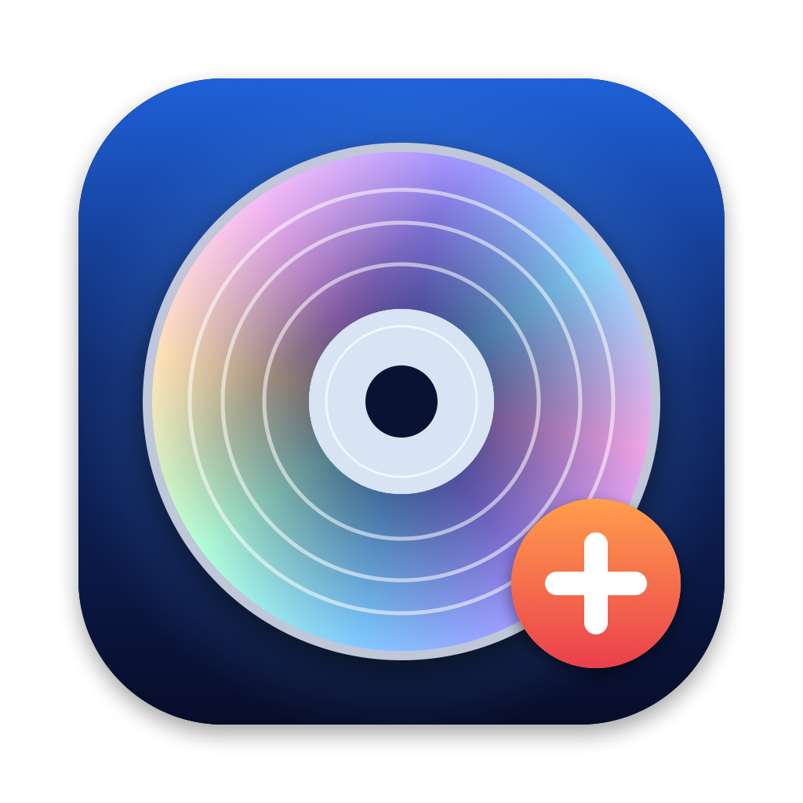

<p align="center"></p>

# BluRay Burner

A small native macOS app for burning data to **BD-R / BDXL** discs in **multiple sessions**.
Drag files and folders into the window and press Burn. Each burn adds a new session,
and files from earlier sessions stay on the disc. It uses
[cdrtools](https://cdrtools.sourceforge.net/private/cdrecord.html) (`cdrecord` + `mkisofs`) to do the actual writing.

## Download

Get `BluRayBurner-<version>.zip` from [Releases](../../releases), unzip it, and move
**BluRayBurner.app** to `/Applications`. It is a universal build (Apple Silicon and Intel) and needs macOS 14 or later.

The app is ad-hoc signed, **not notarized**, so macOS will block it the first time:
right-click the app → **Open** → **Open**. If macOS still says the app "is damaged" (it adds a
quarantine flag to downloaded files), run:
```
xattr -dr com.apple.quarantine "/Applications/BluRayBurner.app"
```

## Requirements

- cdrtools, which is **not** included:
  ```
  brew install cdrtools
  ```
  The app looks for the programs in `/opt/homebrew/bin`, `/usr/local/bin`, `/opt/schily/bin` and `/usr/bin`.
- A Blu-ray writer. Tested with a MATSHITA BD-MLT UJ260 (USB) and 100 GB BDXL BD-R discs.
- No root or sudo needed.

## Usage

1. Insert a blank or appendable BD-R. If macOS has mounted it in Finder, click **Unmount & Read**.
2. Drop files and folders into the window. Each one goes to the root of the disc.
3. Optionally set the volume label, then press **Burn**.
   Leave **Close disc after this session** off to keep the disc appendable.
4. Burn again later to add another session. The new session includes everything from earlier ones.

### Under the hood
```
cdrecord dev=<drive> -msinfo                       # where the previous session ends (appendable discs only)
mkisofs -R -J -joliet-long -iso-level 3 -C <msinfo> -dev <drive> -print-size …   # exact session size
mkisofs … | cdrecord dev=<drive> -data -multi tsize=<N>s -
```
Details and known limits are in [SPEC.md](SPEC.md).

### Known limitations
- Files over 4 GiB are stored as multi-extent ISO9660 files. Linux and Windows read them; the macOS Finder may not.
- If something you add has the same top-level name as an item already on the disc, the new one replaces the old one in the listing.
- Each session uses some extra space on the disc on top of the files.
- Writing to BD-R is permanent. Cancelling a burn usually wastes the space of that session.

## Build from source

Command Line Tools are enough; Xcode is not needed.
```
./build.sh     # -> build/BluRayBurner.app (universal; icon drawn by scripts/make-icon.swift)
./test.sh      # parser + two-session merge tests (the merge test needs cdrtools installed)
```

## Credits

All disc writing is done by **cdrtools** by Jörg Schilling (CDDL-1.0 / GPL-2.0).
cdrtools is **not** bundled; the app runs the copy you installed. See [CREDITS.md](CREDITS.md).

## License

MIT, see [LICENSE](LICENSE). This covers only BluRay Burner's own code.
